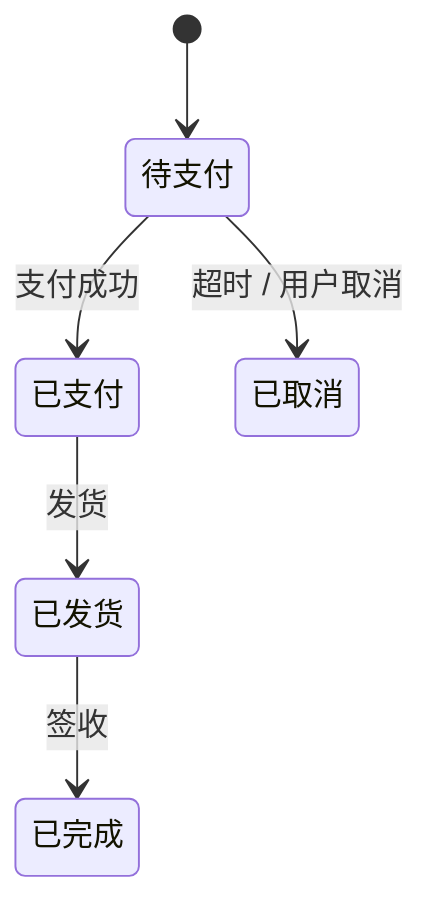
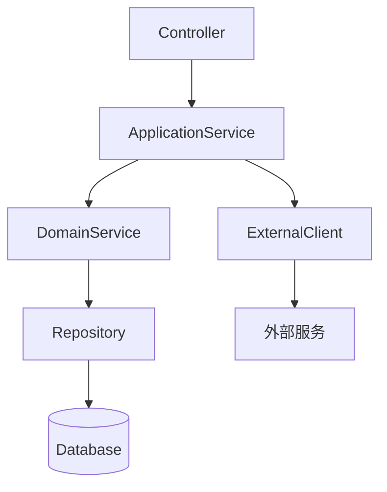
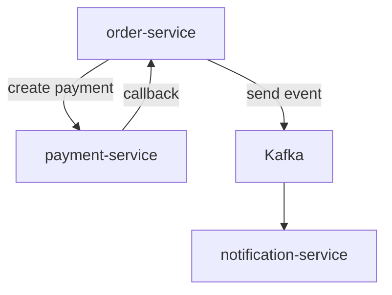

# 阶段 2：逆向理解 —— 操作手册

> **目标**：把陌生或老化的 Java / SpringBoot 代码还原为可被团队理解和验证的业务与技术知识。  
> **前提**：项目初始化已完成，根 `CLAUDE.md` 已就位。  
> **预计耗时**：单个模块约 3–6 小时；复杂模块可能需要 1–2 天。

---

## 1. 所需工具

| 工具 | 用途 | 是否必需 |
|---|---|---|
| **AI 工具**（Claude Code / Cursor / Copilot / 通义灵码） | 解读代码、生成业务文档、反向追问 | 是 |
| **IntelliJ IDEA** | 代码跳转、查看调用链、UML 图、运行调试 | 强烈建议 |
| **Git** | 查看代码历史、定位变更原因 | 是 |
| **Maven / Gradle** | 编译、运行测试 | 是 |
| **数据库客户端**（DBeaver / Navicat / DataGrip） | 查看表结构、字段含义、示例数据 | 强烈建议 |
| **API 测试工具**（curl / Postman / IDEA HTTP Client） | 验证接口实际行为 | 建议 |
| **日志/链路追踪**（SkyWalking / Zipkin / ELK） | 验证跨服务/异步调用链路 | 微服务必需 |
| **JavaParser / AST 分析（可选）** | 批量提取类、方法、注解、调用关系 | 大型项目建议 |
| **PlantUML / Mermaid** | 绘制流程图、类图、序列图 | 建议 |

---

## 2. 环境准备

### 2.1 确认项目可运行

### 2.2 确认数据库/缓存/消息队列可访问

### 2.3 准备分析范围

在动手前，先回答三个问题：

1. **边界**：本次要理解的是哪个模块/功能/链路？
2. **目标**：理解到什么程度？（能改小 bug / 能加新功能 / 能重构）
3. **入口**：从哪个接口、消息、定时任务或页面触发开始？

把答案写在 `docs/modules/{模块名}.md` 的顶部，作为本次逆向理解的范围声明。

---

## 3. 操作步骤

### 步骤 1：定位入口

根据 `docs/entry-points.md` 或代码结构，找到本次要理解的功能入口：

```bash
# 快速查找 Controller
grep -r "@RestController" src/main/java --include="*.java" -l

# 快速查找消息消费者
grep -r "@KafkaListener\|@RabbitListener" src/main/java --include="*.java" -l

# 快速查找定时任务
grep -r "@Scheduled" src/main/java --include="*.java" -l
```

在 IDEA 中，可以用 **Find Usages** 功能追踪调用链。

---

### 步骤 2：静态分析代码

#### 2.1 提取关键代码

把以下代码复制到临时分析文件（或直接在 AI 工具中分段粘贴）：

- Controller 层：接口定义、参数校验、权限注解；
- Service / Application 层：业务编排逻辑；
- Domain 层：实体、值对象、枚举；
- Repository / Mapper 层：数据访问；
- 外部调用：Feign 客户端、HTTP 客户端、消息生产者；
- 配置类：与功能相关的 Bean、开关、阈值。

> **注意**：如果代码量很大，不要一次性全贴给 AI。按“入口 → 核心 Service → 数据访问 → 外部调用”分批次输入。

#### 2.2 使用 reverse-mapping skill

打开 `docs/ai-skills/reverse-mapping.md`，把通用 prompt 复制到 AI 工具中运行：

```markdown
# 角色
你是一名正在接手该 Java / SpringBoot 模块的资深开发者。请根据以下代码，还原该模块的业务逻辑与技术结构。

# 任务
1. 描述该模块的核心业务职责；
2. 列出对外接口（HTTP、消息、定时任务、外部回调等）；
3. 绘制核心业务流程（文字流程图或 Mermaid 图）；
4. 识别关键数据表和领域实体；
5. 指出明显的代码异味或风险点。

# 输入
## 根 CLAUDE.md
{粘贴}

## 模块级 CLAUDE.md（如有）
{粘贴}

## 关键代码
{粘贴 Controller / Service / Mapper / Entity 等}

# 输出格式
## 业务职责
## 接口与入口
## 核心业务流程
## 数据模型
## 风险与异味
```

#### 2.3 识别关键问题

AI 输出后，人工标记以下问题：

- **不确定项**：AI 说“可能”、“似乎”的地方；
- **与代码不符项**：AI 描述与代码实际行为不一致；
- **缺失项**：AI 没有提到的边界条件、异常分支、事务边界。

#### 2.4 启用 Loop 模式（推荐小白与陌生模块场景）

> **原则**：reverse-mapping 是「单次提问」，AI 跑完就停，错了你不一定看得出；reverse-loop 是「闭环」，AI 自己按验收标准打分、修正、停止，并把卡点交给人工。  
> **配套 skill**：`docs/ai-skills/reverse-loop.md`（已在本 SOP 中提供完整模板）。

##### 何时切到 Loop 模式

| 场景 | 推荐模式 |
|---|---|
| 200 行以内的小工具类 / 已熟悉的模块 | reverse-mapping 即可 |
| 第一次接触、代码 > 500 行 | **reverse-loop** |
| 文档要交给业务方 / 新人 review | **reverse-loop** |
| 跑过一次 reverse-mapping 但 2.3 中发现 AI 编造或缺失多 | **reverse-loop** |
| 进入 SOP 阶段 3 共识确认前的最后一道关 | **reverse-loop** |

##### Loop 模式与单次模式的差异（一句话版）

> reverse-mapping 给的是「一份初稿」，reverse-loop 给的是「初稿 + 自查表 + 需人工动作清单」。

##### 调用方式（小白可直接复制粘贴）

**方式 A —— 通用 prompt（任何 AI 工具都能用）**

打开 `docs/ai-skills/reverse-loop.md` § 5，把通用 prompt 复制到 AI 工具中，按提示填入：

- 模块名 / 边界
- 入口（HTTP / 消息 / 定时任务）
- 关键代码（按 入口 → Service → 数据访问 → 外部调用 分批，每批 ≤ 500 行）
- 根 / 模块级 `CLAUDE.md`
- 数据库 schema（如有）

**方式 B —— Claude Code 项目命令**

在仓库内添加 `.claude/commands/reverse-loop.md`（内容见 `docs/ai-skills/reverse-loop.md` § 6），之后直接：

```
/reverse-loop order
```

AI 会自动：扫文件 → 分批读 → 出初稿 → 按 AC1–AC6 自查 → 最多 2 轮修正 → 输出 `docs/modules/order.md` + `docs/modules/order-loop-report.md`。

**方式 C —— Cursor**

在 `.cursorrules` 中加入 reverse-loop 触发规则（见 `docs/ai-skills/reverse-loop.md` § 7），或者在 chat 中直接粘贴通用 prompt。

##### Loop 模式的 6 条验收标准（人工事后抽查也用这套）

| AC | 标准 | 抽查方式 |
|---|---|---|
| AC1 | 业务职责：1 句话 + 1 段，引用 ≥2 处代码行 | 打开引用行，看是否对得上 |
| AC2 | 接口与入口：含 HTTP 方法 / 路径 / 关键参数 / 事务边界 | 对比 Controller 上的注解 |
| AC3 | 核心流程：Mermaid 图，每节点对应一个方法名 | 全局搜索方法名是否真存在 |
| AC4 | 数据模型：每实体对应表名，状态字段列出全部枚举 | 查 enum / SQL 默认值 |
| AC5 | 风险与异味：≥3 条，含文件:行号 | 跳到该行确认是否真有问题 |
| AC6 | 不确定项：全部带 `[待验证]` | 任何无证据的"可能 / 似乎"都应被标记 |

##### 停止条件（防止 AI 越改越偏）

- AC1–AC6 全部 ✅ → 立即停止；
- 已自查修改 2 轮 → 停止并输出"需人工确认清单"，**不再让 AI 继续猜**；
- 已合格的部分不允许为追求完美再次改写。

##### 与下一步的衔接

- Loop 报告里的「需人工确认清单」 → 转化为 SOP 阶段 3「共识确认检查清单」的检查项；
- Loop 报告里的 `[待验证]` 项 → 作为下一步「步骤 3 动态验证」或「步骤 4 grill-deep 反向追问」的输入。

---

### 步骤 3：动态验证

静态分析只能得到“代码写了什么”，动态验证才能确认“实际运行是什么”。

#### 3.1 运行项目并调用入口

备注：可以参考API文档，这块想法挺好的，无论如何变化，数据才是最重要的。

使用 curl 或 IDEA HTTP Client 调用接口：

```bash
curl -X POST http://localhost:8080/api/v1/orders \
  -H "Content-Type: application/json" \
  -d '{"userId":1,"items":[{"skuId":100,"quantity":2}]}'
```

#### 3.2 查看数据库变化

```sql
SELECT * FROM orders ORDER BY id DESC LIMIT 5;
SELECT * FROM order_items WHERE order_id = ?;
```

#### 3.3 查看日志

关注：
- 事务开始/结束；
- 外部调用耗时；
- 异常堆栈；
- 消息发送/消费记录。

#### 3.4 微服务/异步场景验证

如果涉及消息队列或跨服务调用：
- 查看消息主题中是否有消息产生；
- 查看消费者日志；
- 使用链路追踪确认 TraceId 是否串联。

---

### 步骤 4：反向追问（grill-deep）

使用 `docs/ai-skills/grill-deep.md` 对 AI 进行反向提问，验证理解的深度：

```markdown
# 角色
你是一名领域专家。我已经让 AI 初步分析了以下代码，请基于我的问题进一步澄清。

# 输入
- 模块：{模块名}
- AI 初步分析：{粘贴}
- 关键代码：{粘贴}

# 请回答以下问题
1. 如果用户走了异常路径 X，系统会怎么处理？
2. 这个字段为空时会发生什么？数据库会有默认值吗？
3. 这个事务的边界在哪里？是否存在分布式事务？
4. 这个接口的幂等性是如何保证的？
5. 缓存与数据库的一致性策略是什么？
6. 这个业务规则的变更历史是什么？最近一次修改是为什么？
7. 如果并发请求同时到达，这个逻辑是否安全？
```

把 AI 的回答与代码和实际运行结果对比，修正错误理解。

---

### 步骤 5：梳理数据模型

#### 5.1 数据库表结构

导出相关表结构：备注：不要让AI来直接操作数据库，很危险，可以通过手动方式，将数据准备好。


#### 5.2 实体与表的映射

使用 AI 生成实体-表映射表：

```markdown
| 实体类 | 数据库表 | 主要字段 | 说明 |
|---|---|---|---|
| Order | orders | id, user_id, status, total_amount | 订单主表 |
| OrderItem | order_items | id, order_id, sku_id, quantity | 订单明细 |
```

#### 5.3 状态机/枚举梳理

如果业务有状态流转，必须画出状态机：



---

### 步骤 6：绘制架构与流程图

#### 6.1 模块内分层图



#### 6.2 跨模块/服务调用图



---

### 步骤 7：编写模块文档

把以上所有理解写入 `docs/modules/{模块名}.md`。

推荐结构：

```markdown
# 模块：{模块名}

## 理解范围
- 本次目标：能支持 XX 功能改造
- 入口：/api/v1/xxx
- 涉及文件：OrderController.java、OrderService.java、...

## 业务职责
一句话 + 一段详细描述。

## 接口与入口
| 入口 | 类型 | 说明 |
|---|---|---|
| /api/v1/orders | HTTP POST | 创建订单 |
| order.created | Kafka 消息 | 订单创建事件 |

## 核心流程
```mermaid
{粘贴}
```

## 数据模型
| 实体 | 表 | 说明 |
|---|---|---|
| Order | orders | 订单主表 |

## 状态机
```mermaid
{粘贴}
```

## 依赖与调用
- 依赖模块：payment、inventory
- 外部服务：用户中心、支付网关

## 风险与异味
- 风险 1：事务边界过大，可能锁表
- 风险 2：循环中调用外部接口

## 待验证项
- [ ] 支付回调的幂等性机制
- [ ] 订单取消时库存回滚策略
```

---

### 步骤 8：更新全局文档

#### 更新 `docs/entry-points.md`

把新发现的入口补充进去。

#### 更新 `docs/glossary.md`

把新发现的业务术语补充进去。

#### 更新根/模块级 `CLAUDE.md`（如需）

如果本次逆向发现全局约定需要调整（例如新增禁用清单、更新分层规则），则更新 `CLAUDE.md`，并在 `docs/claude-md-changelog.md` 中记录。

---

## 4. 检查清单

- [ ] 本次逆向理解的边界、目标、入口已明确记录；
- [ ] 已选择 reverse-mapping（单次）或 reverse-loop（Loop 模式），且模式选择有理由（见 §2.4）；
- [ ] 已静态分析核心 Controller / Service / Repository / Entity；
- [ ] 如使用 reverse-loop，已检查 AC1–AC6 自查表，且抽查至少 2 个 AC 的证据行号；
- [ ] 已通过运行项目或调用接口验证至少一条核心流程；
- [ ] 已使用 grill-deep 进行反向追问，并处理不一致项；
- [ ] 已梳理数据库表结构与实体映射；
- [ ] 已绘制核心业务流程图和分层/调用图；
- [ ] 已生成 `docs/modules/{模块名}.md`（如使用 Loop，还应包含 `{模块名}-loop-report.md`）；
- [ ] 已更新 `docs/entry-points.md` 和 `docs/glossary.md`；
- [ ] `CLAUDE.md` 中待验证项已标记，未把未确认内容当作事实写入；
- [ ] Loop 模式产出的「需人工确认清单」已逐项处理或转入下一阶段。

---

## 5. 常见问题

### Q1：代码量太大，怎么分批给 AI？

**答**：按“入口 → 核心 Service → 数据访问 → 外部调用”分四批。每批给出代码后，先让 AI 总结这一层职责，再继续下一层。不要一次性给超过 500 行代码。

### Q2：没有测试环境，怎么验证？

**答**：至少做到本地编译通过 + 用 IDEA 的代码分析确认调用链。如果数据库无法访问，可以要求 AI 基于代码和 schema 推断行为，但所有推断必须标记为“待验证”。

### Q3：AI 把业务理解错了，怎么办？

**答**：用 grill-deep 反向追问具体场景，尤其是边界条件和异常路径。把 AI 的回答与代码对比，修正后重写模块文档。

### Q4：微服务场景下，单模块代码无法还原完整链路怎么办？

**答**：先画服务拓扑图，确定每个服务的职责和接口契约。对每个服务单独逆向，然后用 `docs/architecture.md` 把跨服务调用串起来。

### Q5：reverse-loop 比 reverse-mapping 多花多少 token / 时间？

**答**：大约多 40%-80%。单次 prompt 一次出稿 ≈ 1 轮 token 消耗，Loop 模式约 1.5–2 轮（初稿 + 自查 + 最多 1 次修正）。但 **总时间通常更短**——单次 prompt 经常需要人工事后返工补料，Loop 把这部分前移成 AI 自查 + 明确的"需人工确认清单"，避免了反复来回。

### Q6：AC1–AC6 是固定的吗？能不能加自己的验收标准？

**答**：AC1–AC6 是质量下限（必须达成），可以在 prompt 里追加自定义 AC：

- AC7：所有 `@Transactional` 方法必须列出，注明传播行为和隔离级别
- AC8：所有外部 HTTP 调用（Feign / RestTemplate）必须标注超时和重试策略
- AC9：Mybatis XML 必须列出全表名和高频字段

追加时直接写在 prompt 的"验收标准"段落里，AI 会一并检查。

### Q7：AI 自查表里 ✅ 了，我抽查发现是假的怎么办？

**答**：最常见的坑。处理顺序：

1. 把该 AC 在自查表里改成 ⚠️ 或 ❌，附上自己的证据；
2. 把这次"AI 报假"的案例记到 `docs/ai-skills/reverse-loop.md` 的注意事项里，下次 prompt 里特别提醒；
3. 如果同一模块反复出现，在 `CLAUDE.md` 写一行警告："reverse-loop 自查表引用行号过去有编造记录，需人工抽样验证"。

---

## 6. 模板速查

### reverse-mapping 通用 prompt

```markdown
# 角色
你是一名正在接手该 Java / SpringBoot 模块的资深开发者。请根据以下代码，还原该模块的业务逻辑与技术结构。

# 任务
1. 描述该模块的核心业务职责；
2. 列出对外接口（HTTP、消息、定时任务、外部回调等）；
3. 绘制核心业务流程（文字流程图或 Mermaid 图）；
4. 识别关键数据表和领域实体；
5. 指出明显的代码异味或风险点。

# 输入
## 根 CLAUDE.md
{粘贴}

## 模块级 CLAUDE.md（如有）
{粘贴}

## 关键代码
{粘贴 Controller / Service / Mapper / Entity 等}

# 输出格式
## 业务职责
## 接口与入口
## 核心业务流程
## 数据模型
## 风险与异味
```

### grill-deep 反向追问模板

```markdown
请基于以上代码和分析，回答以下问题：
1. 异常路径 X 下系统如何处理？
2. 字段 Y 为空时会发生什么？
3. 事务边界在哪里？
4. 接口是否幂等？如何保障？
5. 缓存与数据库一致性策略是什么？
6. 并发场景是否安全？
7. 最近一次相关代码变更的原因是什么？（可结合 git log）
```

### reverse-loop Loop 版（推荐小白与陌生模块）

> 完整模板见独立 skill 文档：`AI_工作流SOP_阶段2_Skill_reverse-loop.md` § 5  
> 与 reverse-mapping 的差异：自带 6 条验收标准（AC1–AC6）+ 最多 2 轮自查 + 强制输出"自查表 + 需人工确认清单"。  
> 何时切换：见 §2.4。

---

*上一阶段：[阶段 1：项目初始化](./AI_工作流SOP_阶段1_项目初始化_操作手册.md)*  
*下一阶段：[阶段 3：共识确认](./AI_工作流SOP_阶段3_共识确认_操作手册.md)*
