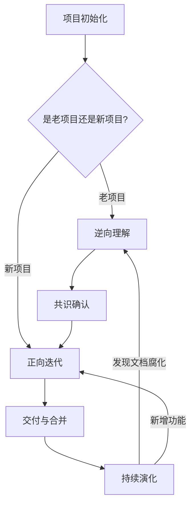

# Java 项目 AI 开发工作流 SOP（双向飞轮落地版）

> **版本**：V1.0  
> **适用场景**：Java / SpringBoot 项目（单体或多模块），使用 AI 辅助进行逆向理解、正向迭代与持续演化。  
> **核心原则**：最小可行闭环、上下文分层、人工审查为必要环节、工具无关设计。  
> **配套文件**：`AI_开发工作流整合_问题与优化报告.md`

---

## 1. 工作流总览



### 1.1 四个阶段

| 阶段 | 目的 | 触发条件 | 主要产出 |
|---|---|---|---|
| **项目初始化** | 建立可复用的 AI 上下文 | 首次引入 AI 辅助、新项目启动、接手老项目前 | 项目根 `CLAUDE.md`、模块级/域级 `CLAUDE.md`、`docs/ai-skills/` |
| **逆向理解** | 把代码反推成业务与技术共识 | 接手老项目、需要理解未知模块、文档缺失 | 业务文档、接口地图、数据模型、术语表 |
| **共识确认** | 把逆向产出转化为可进入正向迭代的输入 | 逆向理解完成后 | 经过 review 的 `CLAUDE.md` 更新、Issue/PRD 草稿 |
| **正向迭代** | 在理解的基础上开发新功能 | 需求明确、CLAUDE.md 已就位 | 测试、代码、文档、PR |
| **持续演化** | 防止上下文与代码再次脱节 | 每次 PR、每月巡检、文档与代码明显不一致 | 文档更新日志、腐化检测报告、改进任务 |

### 1.2 核心原则

1. **最小可行闭环**：不要一次性引入所有 AI skill。先跑通一个模块，再扩展。
2. **上下文分层**：
   - **Tier 1（模型层）**：由模型厂商决定，团队不关注。
   - **Tier 2（项目配置层）**：`CLAUDE.md` + `docs/`，持久化、可复用。
   - **Tier 3（会话层）**：本次 prompt、临时文件、一次性上下文。
3. **人工审查为必要环节**：AI 产出必须经过人类 review，尤其是业务规则、测试用例、架构改动。
4. **工具无关**：不绑定 Claude Code。Skill 以 Markdown 形式保存在 `docs/ai-skills/`，可适配多种 AI 工具。
5. **Loop-first（闭环优先）**：每个阶段的 AI 任务都应包含「验收标准」和「停止条件」。任何超过 2 轮迭代仍未达标的任务，必须输出"卡点报告"交人工，不再让 AI 继续猜。具体落地形式见各阶段 Loop 版 skill（如阶段 2 的 `reverse-loop`）。

---

## 2. 阶段一：项目初始化

### 2.1 触发条件

- 新项目启动；
- 首次引入 AI 辅助开发；
- 准备接手老项目；
- 现有 `CLAUDE.md` 明显过时或缺失。

### 2.2 输入

- 项目源码仓库；
- `pom.xml` / `build.gradle`（技术栈、依赖）；
- 现有 README（如有）；
- 架构文档或 ADR（如有）；
- 团队编码规范（如有）。

### 2.3 输出产物

| 产物 | 路径 | 说明 |
|---|---|---|
| 项目根 `CLAUDE.md` | `CLAUDE.md` | 全局约束，<200 行 |
| 模块级/域级 `CLAUDE.md` | 每个 Maven/Gradle 模块或业务域内 `CLAUDE.md` | 模块/域专属约定 |
| AI skill 目录 | `docs/ai-skills/` | 工具无关的 prompt 模板 |
| 术语表 | `docs/glossary.md` | 领域术语与业务规则 |
| 架构决策记录 | `docs/adr/` | 关键架构选择 |
| 入口地图 | `docs/entry-points.md` | 关键接口、调度入口、消息入口 |

### 2.4 执行步骤

#### 步骤 1：信息收集（人工完成）

- 确认项目类型：单体 / 多模块 / 微服务；
- 确认技术栈：Spring Boot 版本、JDK 版本、ORM、数据库、缓存、消息队列、构建工具；
- 确认团队约定：包结构、命名规范、测试策略、代码审查规则。

#### 步骤 2：生成根 `CLAUDE.md`（AI 辅助 + 人工 review）

使用以下 prompt 模板：

```markdown
# 角色
你是一名熟悉 Java / SpringBoot 的资深技术写手。请根据以下项目信息，生成一份简洁的 `CLAUDE.md` 初稿。

# 约束
- 总行数不超过 200 行；
- 只包含全局性、长期稳定的约定；
- 不展开具体业务规则，只保留指针；
- 输出为 Markdown 格式。

# 项目信息
- 项目类型：单体 / 多模块 / 微服务
- Spring Boot 版本：
- JDK 版本：
- 构建工具：Maven / Gradle
- 数据库与 ORM：
- 缓存：
- 消息队列：
- 包结构约定：
- 测试框架：
- 代码审查红线：

# 输出格式
---
## 技术栈
## 分层与包结构
## 核心约定（不可违反）
## 测试策略
## 文档与上下文指针
## 禁用清单
## 未知区域（待补）
---
```

#### 步骤 3：建立模块级/域级 `CLAUDE.md`（按需）

- **多模块项目**：每个 Maven/Gradle 模块根目录放一个 `CLAUDE.md`；
- **单模块多业务域项目**：按业务域在 `docs/domains/` 或 `docs/modules/` 下创建域级 `CLAUDE.md`，不要为每个 Controller 创建；
- 模块级/域级文件只包含该模块/域的职责、依赖关系、关键类、结构性约定，不展开具体业务规则；
- 当 AI 会话进入该模块/域时，显式引用对应的 `CLAUDE.md`。

#### 步骤 4：建立 `docs/ai-skills/` 目录

把以下 skill 写成独立的 Markdown 文件：

- `grill-light.md`：轻量级需求澄清；
- `grill-deep.md`：深度架构/业务 grilling；
- `to-prd.md`：需求 → PRD；
- `to-issues.md`：PRD → 开发任务；
- `tdd.md`：测试驱动开发；
- `codex-review.md`：代码预审查；
- `reverse-mapping.md`：逆向梳理代码；
- `wt-new.md`：Git Worktree 创建规范。

每个 skill 文件包含：目标、输入、输出、通用 prompt、Claude Code 适配、Cursor 适配、注意事项。

#### 步骤 5：建立入口地图和术语表

- `docs/entry-points.md`：列出所有 Controller、定时任务、消息消费者、外部回调入口；
- `docs/glossary.md`：列出业务术语、领域对象、状态机、关键规则。

### 2.5 检查清单

- [ ] 项目根 `CLAUDE.md` 已生成且 <200 行；
- [ ] 模块级/域级 `CLAUDE.md` 已覆盖所有核心模块或业务域（如适用）；
- [ ] `docs/ai-skills/` 至少包含 grill-light、to-prd、tdd、codex-review 四个 skill；
- [ ] `docs/glossary.md` 已包含关键业务术语；
- [ ] `docs/entry-points.md` 已列出关键接口与入口；
- [ ] 所有 AI 工具配置都指向同一个 skill 目录（不依赖隐藏目录）。

---

## 3. 阶段二：逆向理解（Reverse Engineering）

### 3.1 触发条件

- 接手老项目；
- 需要理解一个不熟悉的核心模块；
- 现有文档与代码明显不符；
- 准备对旧模块进行重大改造。

### 3.2 输入

- 项目源码；
- 根 `CLAUDE.md` 和模块级 `CLAUDE.md`；
- 数据库 schema / SQL 文件；
- 接口文档（OpenAPI / Swagger / 历史接口文档）；
- 日志 / 链路追踪数据（如适用）。

### 3.3 输出产物

| 产物 | 路径 | 说明 |
|---|---|---|
| 业务模块说明 | `docs/modules/{模块名}.md` | 每个模块的职责、业务流程、依赖 |
| 接口地图 | `docs/api-map.md` | Controller / 外部接口 / 消息入口 |
| 数据模型说明 | `docs/data-model.md` | 领域实体、数据库表、字段含义 |
| 术语表更新 | `docs/glossary.md` | 新增/修正业务术语 |
| 架构图 | `docs/architecture.md` 或 `.png` | 分层与依赖关系 |

### 3.4 执行步骤

#### 步骤 1：选择范围（人工）

- 明确本次逆向理解的边界：一个模块、一个功能域、一个用户故事链路；
- 不要试图一次性理解整个系统。

#### 步骤 2：静态分析（AI 辅助）

把目标模块的关键代码输入 AI，使用 `reverse-mapping` skill：

```markdown
# 角色
你是一名正在接手该 Java / SpringBoot 模块的资深开发者。请根据以下代码，还原该模块的业务逻辑与技术结构。

# 任务
1. 描述该模块的核心业务职责；
2. 列出对外接口（HTTP、消息、定时任务等）；
3. 绘制核心业务流程（文字流程图即可）；
4. 识别关键数据表和领域实体；
5. 指出明显的代码异味或风险点。

# 输入
- 根 CLAUDE.md：{粘贴}
- 模块级 CLAUDE.md：{粘贴}
- 关键代码：{粘贴 Controller / Service / Mapper / Entity 等}

# 输出格式
## 业务职责
## 接口与入口
## 核心业务流程
## 数据模型
## 风险与异味
```

#### 步骤 3：动态验证（人工 + 测试）

- 如果可能，运行目标模块，通过实际请求验证 AI 的解读；
- 检查日志、数据库变化、消息队列是否如 AI 描述。

#### 步骤 4：交叉确认

- 使用 `/grill-deep`（或等价的深度对话）对 AI 进行反向追问：
  - “如果用户走了 X 路径，系统会怎么做？”
  - “这个字段为空时会发生什么？”
  - “这个事务边界在哪里？”
- 记录 AI 回答与代码不一致的地方，人工修正。

#### 步骤 5：文档化

- 把验证后的理解写入 `docs/modules/{模块名}.md`；
- 更新 `docs/glossary.md` 和 `docs/entry-points.md`；
- 如果涉及跨模块调用，更新 `docs/architecture.md`。

### 3.5 检查清单

- [ ] 本次逆向理解的边界已明确；
- [ ] 至少已静态分析关键 Controller / Service / Repository / Entity；
- [ ] 已通过测试或日志验证至少一条核心流程；
- [ ] AI 输出中的不确定性已标记为“待验证”；
- [ ] 已生成/更新模块文档、术语表、入口地图。

---

## 4. 阶段三：共识确认（Consensus Gate）

### 4.1 触发条件

- 逆向理解完成后；
- 准备进入正向迭代前；
- 发现现有 `CLAUDE.md` 与代码理解不一致。

### 4.2 输入

- 逆向理解产出（`docs/modules/`、`docs/glossary.md` 等）；
- 当前 `CLAUDE.md`；
- 产品/业务方的需求描述（如有）。

### 4.3 输出产物

| 产物 | 路径 | 说明 |
|---|---|---|
| 更新后的 `CLAUDE.md` | `CLAUDE.md` / 模块级 `CLAUDE.md` | 吸收本次理解的关键约束 |
| 共识检查清单 | `docs/consensus-checklist.md` | 进入正向迭代前必须确认的事项 |
| PRD / Issue 草稿 | `docs/prd/{功能名}.md` 或 issue 链接 | 正向迭代的输入 |

### 4.4 执行步骤

#### 步骤 1：比对 AI 理解与团队共识

- 把 AI 生成的模块文档交给熟悉该模块的开发者或业务方 review；
- 重点确认：业务术语、状态流转、边界条件、数据一致性要求。

#### 步骤 2：更新 `CLAUDE.md`

- 只把**长期稳定**的共识写入 `CLAUDE.md`；
- 临时性、一次性信息留在会话层或具体 PRD 中。

#### 步骤 3：生成共识检查清单

示例：

```markdown
## 共识检查清单

- [ ] 该模块的核心业务目标已被业务方确认；
- [ ] 所有关键状态字段都有明确的合法取值和流转规则；
- [ ] 所有外部接口的输入输出格式已确认；
- [ ] 事务边界和并发风险已识别；
- [ ] 该模块的依赖模块和调用关系已记录；
- [ ] `CLAUDE.md` 已更新，且未超过 200 行（根）或 150 行（模块级）。
```

#### 步骤 4：生成 PRD / Issue 草稿

- 基于共识，用 `/to-prd` skill 生成 PRD；
- 再用 `/to-issues` 拆分为可开发任务；
- 每个任务应关联一个验收标准（AC）。

### 4.5 检查清单

- [ ] 逆向产出已经过至少一人 review；
- [ ] `CLAUDE.md` 已更新并符合行数约束；
- [ ] 共识检查清单已全部勾选；
- [ ] PRD / Issue 已生成并明确验收标准。

---

## 5. 阶段四：正向迭代（Forward Development）

### 5.1 触发条件

- 共识确认完成；
- 已有一个明确的 PRD / Issue；
- `CLAUDE.md` 已就位。

### 5.2 输入

- PRD / Issue；
- `CLAUDE.md`（根 + 模块级）；
- 相关代码参考；
- 现有测试用例（如有）。

### 5.3 输出产物

| 产物 | 路径 | 说明 |
|---|---|---|
| 实现代码 | 对应模块源码 | 符合 CLAUDE.md 约定 |
| 测试代码 | `src/test/java/...` | 单元测试 + 必要集成测试 |
| PRD 更新 | `docs/prd/{功能名}.md` | 如需求有变更，同步更新 |
| 代码审查记录 | PR / MR 评论 | AI 预审查 + 人工审查 |
| 文档更新 | `CLAUDE.md` / `docs/` | 如有新术语、新入口，同步更新 |

### 5.4 执行步骤

#### 步骤 1：判断是否需要 Worktree

| 场景 | 是否使用 Worktree |
|---|---|
| 修一行 typo / 注释 | 否 |
| 单个独立 bug | 可选 |
| 新功能开发 | 是 |
| 多 AI 会话并行开发 | 是 |
| 长期实验性分支 | 是 |

如果使用 Worktree，执行：

```bash
# 创建独立工作区
git worktree add ../{project}-{feature} -b feat/{feature}
cd ../{project}-{feature}

# 配置隔离环境（端口、数据库、Redis）
cp application-worktree.yml application.yml
# 或：docker-compose -f docker-compose.{feature}.yml up -d
```

#### 步骤 2：需求澄清（/grill-light 或 /grill-deep）

- 让 AI 基于 PRD 和 `CLAUDE.md` 进行反向提问；
- 澄清边界条件、异常场景、权限/性能约束。

#### 步骤 3：生成测试（TDD）

使用 `/tdd` skill：

```markdown
# 角色
你是一名 Java / SpringBoot 测试工程师。请为以下功能先写测试，再写实现。

# 约束
- 优先写单元测试；
- 涉及数据库、缓存、外部服务时，使用 @MockBean 或 Testcontainers；
- 每个测试必须明确 Arrange / Act / Assert；
- 不要只测 happy path，必须覆盖边界条件；
- 输出完整的 JUnit 5 + Mockito 测试代码。

# 输入
- PRD：{粘贴}
- CLAUDE.md：{粘贴}
- 相关现有代码：{粘贴}

# 任务
1. 列出需要测试的用例（含边界条件）；
2. 写出第一个失败的测试（RED）；
3. 写出让测试通过的最小实现（GREEN）；
4. 如果有必要，建议重构方向。
```

#### 步骤 4：AI 预审查（Codex Review 前移）

在提交人工 PR 前，先用 `/codex-review` skill：

```markdown
# 角色
你是一名 Java 代码审查员。请审查以下代码变更，重点关注：
1. 是否违反 CLAUDE.md 中的约定；
2. 是否有明显的并发、空指针、事务、安全问题；
3. 测试是否覆盖了关键路径；
4. 命名和包结构是否一致。

# 输入
- CLAUDE.md：{粘贴}
- 变更 diff：{粘贴}
```

记录 AI 提出的问题，人工判断是否需要修改。

#### 步骤 5：人工审查与合并

- 提交 PR / MR；
- 人工审查必须关注：AI 生成的业务逻辑是否与共识一致、测试质量、架构影响；
- 合并前确保 CI 通过（编译、测试、静态检查）。

### 5.5 检查清单

- [ ] 已判断是否需要 Worktree，并已配置隔离环境（如使用）；
- [ ] 已用 `/grill-light` 或 `/grill-deep` 澄清需求；
- [ ] 已生成测试且至少覆盖关键路径和边界条件；
- [ ] 已进行 AI 预审查并处理关键问题；
- [ ] 已提交人工 PR 并通过 CI；
- [ ] 如有新术语/新入口，已更新 `CLAUDE.md` 或 `docs/`。

---

## 6. 阶段五：持续演化（Continuous Evolution）

### 6.1 触发条件

- 每次 PR / MR 合并后；
- 每月定期巡检；
- 发现代码与文档明显不一致；
- 模型/工具升级，需要调整 skill prompt。

### 6.2 输入

- 最近合并的 PR diff；
- 当前 `CLAUDE.md` 和 `docs/`；
- 运行中的 CI 日志。

### 6.3 输出产物

| 产物 | 路径 | 说明 |
|---|---|---|
| 文档腐化检测报告 | `docs/reports/doc-rot-{日期}.md` | 发现的不一致项 |
| `CLAUDE.md` 更新日志 | `docs/claude-md-changelog.md` | 每次更新原因与 diff |
| 改进任务 | issue / 待办清单 | 需要修复的问题 |
| skill 更新 | `docs/ai-skills/` | 根据实战经验优化 prompt |

### 6.4 执行步骤

#### 步骤 1：PR 级 AI 审查（轻量）

在 CI 或 PR 流程中增加一个轻量检查：

```bash
# 检查 CLAUDE.md 中引用的文件是否仍然存在
python scripts/check_claude_md_refs.py

# 检查关键接口是否有变更但未同步文档
python scripts/check_api_doc_sync.py
```

#### 步骤 2：每月文档腐化巡检（深度）

每月运行一次：

```markdown
# 角色
你是该 Java 项目的知识管理专员。请检查以下文档与代码的一致性，并输出腐化检测报告。

# 检查项
1. `CLAUDE.md` 中提到的关键类/接口是否仍然存在；
2. `docs/entry-points.md` 中的接口是否与代码一致；
3. `docs/glossary.md` 中的术语是否仍被代码使用；
4. 过去一个月合并的 PR 中，是否有变更未同步到文档；
5. `docs/ai-skills/` 中的 prompt 是否仍适用于当前模型版本。

# 输出格式
## 总体健康度
## 发现的不一致项（按优先级）
## 建议修复动作
## 需要人工确认的区域
```

#### 步骤 3：更新 `CLAUDE.md` 并记录变更日志

- 只有发生实质性变更时才更新 `CLAUDE.md`；
- 每次更新在 `docs/claude-md-changelog.md` 中记录：日期、变更原因、影响范围、审批人。

#### 步骤 4：优化 AI skill

- 根据实战中的失败案例，持续优化 `docs/ai-skills/` 中的 prompt；
- 每季度 review 一次 skill 有效性。

### 6.5 检查清单

- [ ] PR 流程中已集成轻量的文档引用检查；
- [ ] 每月已运行一次文档腐化巡检；
- [ ] `CLAUDE.md` 更新已记录变更日志；
- [ ] 发现的腐化项已转化为具体 issue；
- [ ] AI skill 已根据实战经验迭代。

---

## 7. 工具适配说明

本工作流不绑定特定 AI 工具。`docs/ai-skills/` 中的每个 skill 文件都应包含：

| 章节 | 内容 |
|---|---|
| 目标 | 该 skill 解决什么问题 |
| 触发条件 | 何时使用 |
| 输入 | 需要准备哪些材料 |
| 输出 | 预期产物 |
| 通用 prompt | 可在任何 AI 工具中使用的完整 prompt |
| Claude Code 适配 | 如何写成 `.claude/commands/{skill}.md` |
| Cursor 适配 | 如何在 Cursor 中使用（如 `.cursorrules` 或 chat） |
| 注意事项 | 常见陷阱、人工审查点 |

### 7.1 推荐工具映射

| 工作流环节 | 推荐工具 | 替代方案 |
|---|---|---|
| 需求澄清 | Claude Code / Cursor / ChatGPT | 通义灵码、CodeGeeX |
| 代码生成 | Claude Code / Cursor / GitHub Copilot | CodeBuddy、CodeGeeX |
| 代码审查 | Claude Code / Cursor | SonarQube + 人工 |
| 文档生成 | AI chat + 人工整理 | 自动生成脚本 + LLM |
| 多会话并行 | Claude Code + Git Worktree | Cursor + Git Worktree |

---

## 8. 异常处理与决策点

### 8.1 逆向理解发现代码与文档严重不符

- **暂停正向迭代**；
- 优先更新 `CLAUDE.md` 和 `docs/modules/`；
- 如果涉及业务规则，需要业务方确认。

### 8.2 AI 生成的测试无法通过

- 检查是否是 AI 对 Spring 上下文理解错误（如缺少 `@SpringBootTest`、Mock 注入错误）；
- 如果测试逻辑本身正确但实现未满足，先修复实现；
- 如果测试逻辑错误，人工修正测试，并把案例反馈到 `/tdd` skill 优化中。

### 8.3 多模块项目如何拆分 AI 会话

- 优先按**限界上下文 / 业务模块**拆分；
- 每个模块独立使用自己的 `CLAUDE.md`；
- 跨模块调用通过 `docs/architecture.md` 和接口契约来对齐。

### 8.4 微服务项目的逆向策略

- 先绘制服务拓扑图；
- 每个服务独立逆向；
- 重点关注：服务间接口契约、消息格式、Saga / 分布式事务、事件溯源。

---

## 9. 度量指标

| 指标 | 计算方式 | 目标 |
|---|---|---|
| 文档覆盖率 | 有 `docs/modules/` 说明的核心模块数 / 总核心模块数 | ≥ 80% |
| CLAUDE.md 新鲜度 | 最近 30 天内更新过的 `CLAUDE.md` 占比 | ≥ 70% |
| AI 生成测试通过率 | AI 生成测试首次运行通过率 | ≥ 60%（逐步提升） |
| AI 预审查问题采纳率 | 被人工采纳的 AI 审查建议 / AI 总建议数 | ≥ 50% |
| 文档腐化检出率 | 每月巡检发现的不一致项数 / 检查项总数 | 趋于 0 |
| 正向迭代闭环率 | 完成共识确认 → 交付 → 文档更新的功能数 / 总功能数 | ≥ 80% |

---

## 10. 版本历史

| 版本 | 日期 | 变更说明 |
|---|---|---|
| V1.0 | 2026-06-19 | 初始版本，基于问题与优化报告设计 |
| V1.1 | 2026-06-23 | §1.2 新增"Loop-first"核心原则；阶段 2/3/4/5 引入 5 个 Loop 版 skill；新增 `AI_工作流SOP_Loop化总览.md` |

---

## 11. 相关文件

- 📖 **`AI_工作流SOP_Loop化总览.md`：5 个阶段 Loop skill 总览 + 衔接关系图（推荐先读）**
- `AI_开发工作流整合_问题与优化报告.md`：问题分析原文
- `CLAUDE.md_使用指南.md`：CLUADE.md 分层、内容边界、使用方式
- `docs/ai-skills/`：工具无关的 AI skill 模板（待后续创建）
- `CLAUDE.md`：项目级上下文（待后续创建）

### 各阶段操作手册

- `AI_工作流SOP_阶段1_项目初始化_操作手册.md`
- `AI_工作流SOP_阶段2_逆向理解_操作手册.md`
- `AI_工作流SOP_阶段3_共识确认_操作手册.md`
- `AI_工作流SOP_阶段4_正向迭代_操作手册.md`
- `AI_工作流SOP_阶段5_持续演化_操作手册.md`

### Loop 版 Skill 文档（按阶段）

- `AI_工作流SOP_阶段2_Skill_reverse-loop.md` —— 逆向理解 Loop 版
- `AI_工作流SOP_阶段3_Skill_grill-deep-loop.md` —— 深度反向追问 Loop 版
- `AI_工作流SOP_阶段4_Skill_tdd-loop.md` —— 测试驱动开发 Loop 版
- `AI_工作流SOP_阶段4_Skill_codex-review-loop.md` —— 代码预审 Loop 版
- `AI_工作流SOP_阶段5_Skill_doc-rot-loop.md` —— 文档腐化巡检 Loop 版
