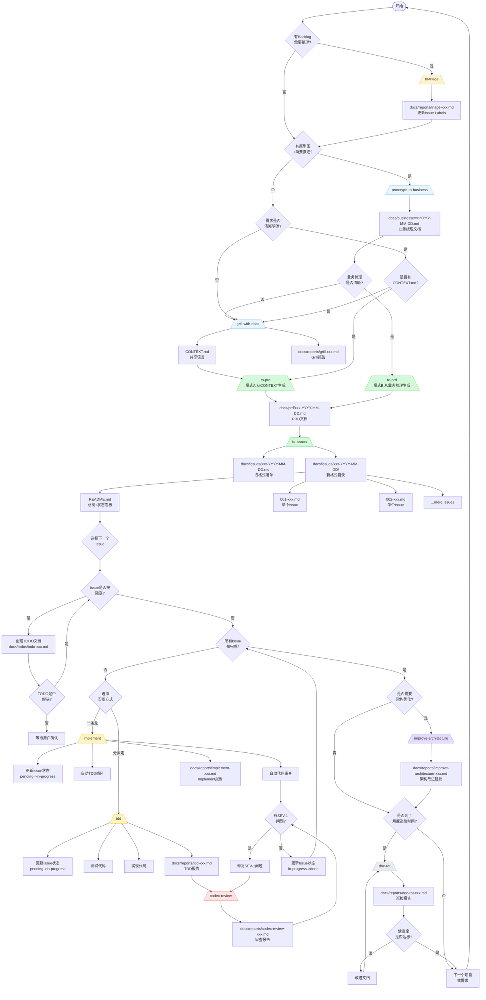
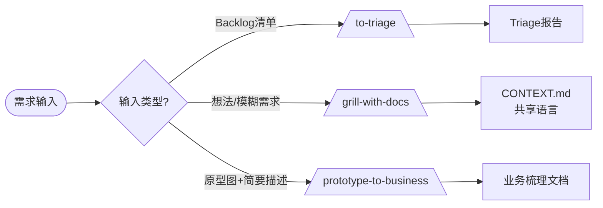
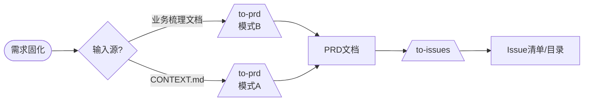
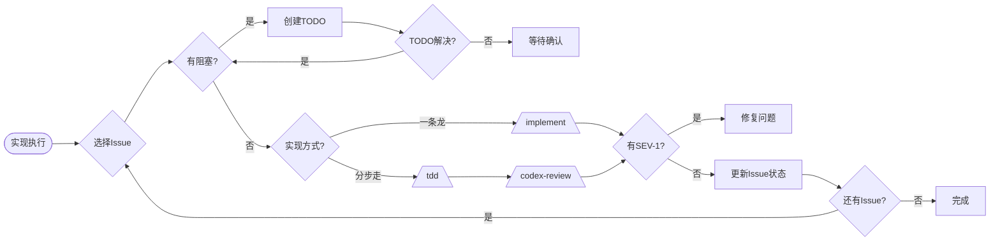
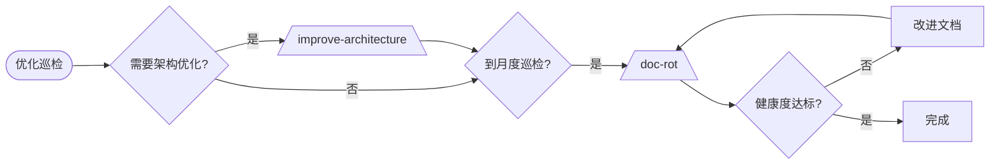
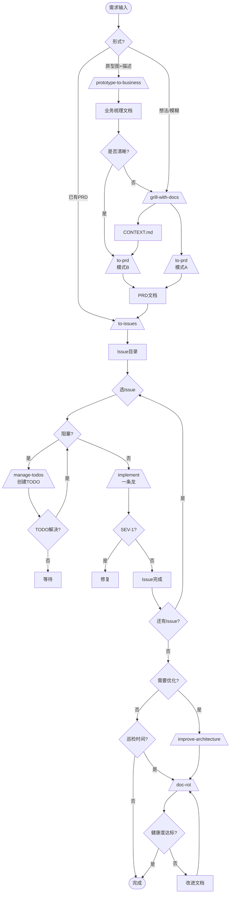

# Opus48 v2.3 完整流程图分析

> **日期**：2026-07-10
> **版本**：v2.3
> **目的**：展示完整流程图，分析优化点

---

## 📊 全景流程图（两种模式）



---

## 🔍 各阶段详细流程

### 阶段 1：需求输入


### 阶段 2：需求固化


### 阶段 3：实现执行


### 阶段 4：优化巡检


---

## ⚠️ 优化点分析

### 🔴 P0 高优先级

#### 1. Skill编号不连续
**问题**：
- 01-triage
- 02-grill-with-docs
- 02.5-prototype-to-business ← 小数点，不规范
- 03-handoff
- 04-prototype

**建议优化**：
```
选项A：重新编号
- 01-triage
- 02-grill-with-docs
- 03-prototype-to-business (新增)
- 04-handoff
- 05-prototype
- ...其余依次后移

选项B：保持现状，但添加说明
- 在文档中说明 02.5 是插入的中间阶段
```

**建议**：采用选项A，保持编号连续。

---

#### 2. Skill名称冲突
**问题**：
- 04-prototype（草稿探索）
- 03-prototype-to-business（原型转业务梳理）

这两个名字都有"prototype"，容易混淆。

**建议优化**：
```
重命名：
- 04-prototype → 05-spike（Spike探索，符合极限编程术语）
或
- 03-prototype-to-business → 03-design-to-requirements（设计转需求）
```

---

### 🟡 P1 中优先级

#### 3. /to-issues 生成双重格式
**问题**：
- 当前设计为同时生成旧格式和新格式
- 两个格式都存在，可能导致用户困惑

**建议优化**：
```
选项A：只生成新格式，旧格式保留模板但不主动生成
- 在Skill中添加参数，让用户选择生成哪种格式
- 默认生成新格式

选项B：明确说明新旧格式的区别和使用场景
- 在文档中说明：新项目用新格式，旧项目可以继续用旧格式
```

---

#### 4. 缺少TODO管理的Skill
**问题**：
- TODO文档需要手动创建和更新
- TODO状态变更需要手动修改历史记录
- TODO的创建和解决没有专门的Skill

**建议优化**：
```
新增 Skill：/manage-todos
功能：
- 创建TODO文档
- 关联阻塞的Issue
- 更新TODO状态（open -> resolved -> closed）
- 自动更新关联Issue的状态
- 生成TODO列表总览
```

---

#### 5. 缺少从PRD回退的分支
**问题**：
- 如果PRD生成后发现问题，没有明确的回退路径
- 需要重新走 Grill → PRD，但没有明确的说明

**建议优化**：
```
在 05-WORKFLOW.md 中添加回退流程说明
- 发现PRD问题 → 更新业务梳理文档 或 更新CONTEXT.md → 重新生成PRD
```

---

### 🟢 P2 低优先级

#### 6. 缺少可视化的进度看板
**问题**：
- Issue状态分散在各个文件中
- 没有整体的进度可视化

**建议优化**：
```
在 docs/issues/README.md 中添加更丰富的可视化看板
- 燃尽图
- 进度条
- 甘特图（可选）
```

---

#### 7. 缺少快速启动脚本
**问题**：
- 新手需要手动复制多个模板文件
- 没有一键初始化项目的脚本

**建议优化**：
```
新增 scripts/init-project.sh
功能：
- 复制CONTEXT.md.template到项目根目录
- 创建docs/business/, docs/prd/, docs/issues/, docs/todos/, docs/reports/ 目录
- 创建初始README
```

---

#### 8. 缺少示例的完整流程演示
**问题**：
- 当前示例项目只有PRD和Issue
- 缺少从原型图开始的完整示例

**建议优化**：
```
在 examples/ 目录下新增：
- examples/from-prototype/ - 从原型图开始的完整示例
- 包含原型图描述 → 业务梳理 → PRD → Issue → 实现的完整流程
```

---

## 📋 优化后推荐的完整流程

### 推荐的最佳实践路径


---

## 🎯 总结建议

### 立即处理（v2.3.1）
1. ✅ 重新编号 Skill，解决 02.5 的问题
2. ✅ 考虑重命名 prototype-to-business 或 prototype 避免冲突
3. ✅ 明确新旧格式的使用策略

### 下一个版本（v2.4）
1. 新增 /manage-todos Skill
2. 添加回退流程说明
3. 增加进度看板可视化

### 长期规划（v3.0）
1. 添加快速启动脚本
2. 完善示例项目
3. 添加更多集成点（GitHub Issues、Jira等）

---

## 📝 决策记录

| ID | 决策 | 状态 | 备注 |
|---|---|---|---|
| DECISION-001 | Skill重新编号方式 | 待确认 | 选项A vs 选项B |
| DECISION-002 | 命名冲突解决方案 | 待确认 | 重命名哪个? |
| DECISION-003 | 新旧格式策略 | 待确认 | 同时生成?二选一? |

---

**文档结束**
