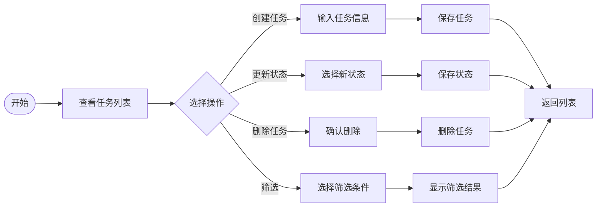

# 业务梳理：任务管理系统

> **创建日期**：2026-06-28
> **版本**：v1.0

---

## 1. 输入信息

### 1.1 原型图
用户提供了原型图，包括：
- 任务列表页面：显示所有任务，带筛选功能
- 创建任务对话框：输入标题、优先级
- 任务详情页面：显示任务信息，更新状态、删除

### 1.2 简要描述
一个简单的任务管理工具，用户可以创建任务、查看任务列表、更新任务状态、删除任务、按优先级筛选。

---

## 2. 用户角色

| 角色 | 描述 |
|---|---|
| 普通用户 | 使用任务管理系统的用户，可以创建、查看、更新、删除任务 |

---

## 3. 业务流程

### 3.1 正常流程

### 3.2 异常流程

| 场景 | 触发条件 | 处理方式 |
|---|---|---|
| 创建任务失败 | 标题为空 | 提示用户标题不能为空 |
| 更新状态失败 | 任务不存在 | 提示任务不存在，刷新列表 |
| 删除任务失败 | 任务不存在 | 提示任务不存在，刷新列表 |

---

## 4. 功能清单

| 序号 | 功能点 | 优先级 | 说明 |
|---|---|---|---|
| 1 | 用户可以创建任务 | P0 | 输入标题，选择优先级，保存 |
| 2 | 用户可以查看任务列表 | P0 | 显示所有任务，按创建时间倒序 |
| 3 | 用户可以更新任务状态 | P1 | 待办 → 进行中 → 已完成 |
| 4 | 用户可以删除任务 | P1 | 删除不需要的任务 |
| 5 | 用户可以按优先级筛选 | P2 | 只看高/中/低优先级任务 |

---

## 5. 数据需求

### 5.1 核心实体

| 实体名 | 字段 | 类型 | 必填 | 说明 |
|---|---|---|---|---|
| Task | id | String | 是 | 任务唯一标识 |
| | title | String | 是 | 任务标题 |
| | status | String | 是 | 状态：todo/in-progress/done |
| | priority | String | 否 | 优先级：low/medium/high，默认 medium |
| | createdAt | DateTime | 是 | 创建时间 |

### 5.2 数据流转
用户创建任务 → 系统保存到存储 → 任务列表查询显示
用户更新状态 → 系统更新状态字段 → 列表显示新状态
用户删除任务 → 系统删除任务 → 列表不再显示

---

## 6. 界面描述

### 6.1 页面 1：任务列表

| 元素 | 类型 | 说明 |
|---|---|---|
| 页面标题 | 文本 | "任务列表" |
| 创建任务按钮 | 按钮 | 点击打开创建对话框 |
| 筛选下拉框 | 选择器 | 优先级筛选：全部/高/中/低 |
| 任务卡片列表 | 列表 | 显示多个任务卡片 |
| 任务卡片标题 | 文本 | 任务标题 |
| 任务状态标签 | 标签 | todo/进行中/已完成，不同颜色 |
| 更新状态按钮 | 按钮 | 循环切换状态 |
| 删除按钮 | 按钮 | 删除任务 |

**布局描述**：
顶部是标题、创建按钮、筛选下拉框；下方是任务列表，每个任务是一个卡片，包含标题、状态标签、操作按钮。

**交互描述**：
- 点击创建任务 → 弹出对话框
- 选择筛选选项 → 列表自动刷新
- 点击更新状态 → 状态循环切换
- 点击删除 → 弹出确认框，确认后删除

---

## 7. 验收标准（初稿）

| 序号 | 验收标准 |
|---|---|
| 1 | 调用 createTask("买牛奶") 可以创建任务，返回任务ID |
| 2 | 调用 getTasks() 可以看到刚创建的任务 |
| 3 | 任务默认状态为 todo |
| 4 | 任务默认优先级为 medium |
| 5 | 任务列表按创建时间倒序排列 |
| 6 | 可以把任务状态从 todo 改为 in-progress |
| 7 | 可以把任务状态从 in-progress 改为 done |
| 8 | 调用 deleteTask(taskId) 可以删除任务 |
| 9 | getTasks({ priority: "high" }) 只返回高优先级任务 |

---

## 8. 风险点

| 风险 | 影响程度 | 建议方案 |
|---|---|---|
| 未考虑持久化 | 中 | 第一版用内存存储，后续根据需求增加持久化 |
| 未考虑多用户 | 低 | 第一版单用户，后续根据需求扩展 |
| 未考虑任务截止日期 | 低 | 第一版先不做，后续根据需求增加 |

---

## 9. 待确认问题

- [ ] 是否需要任务描述字段？（建议第一版先不加）
- [ ] 是否需要任务截止日期？（建议第一版先不加）
- [ ] 是否需要多用户支持？（建议第一版先不做）
- [ ] 数据是否需要持久化？（建议第一版用内存存储）

---

## 10. 相关文档

- [CONTEXT.md](../../CONTEXT.md)
- [PRD](../prd/task-management-2026-06-28.md)
