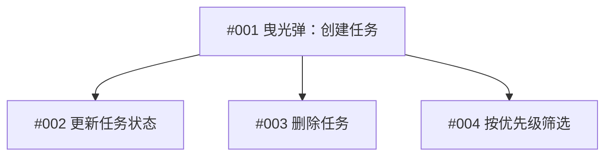

# Issues：任务管理系统

> **创建日期**：2026-06-28
> **总 Issue 数**：4
> **对应 PRD**：[任务管理系统](../prd/task-management-2026-06-28.md)

---

## 📊 状态看板

| 状态 | 数量 | Issue |
|------|------|-------|
| 🟣 pending | 4 | #001, #002, #003, #004 |
| 🔵 in-progress | 0 | - |
| 🚧 blocked | 0 | - |
| ✅ done | 0 | - |

---

## 📋 执行顺序（建议）

### 第 1 步：曳光弹

- [Issue 001](001-创建任务并看到在列表中.md)：用户可以创建任务并看到在列表中 — HITL — 无依赖

### 第 2 步：核心功能

- [Issue 002](002-更新任务状态.md)：用户可以更新任务状态 — AFK — 依赖 #001
- [Issue 003](003-删除任务.md)：用户可以删除任务 — AFK — 依赖 #001

### 第 3 步：完善

- [Issue 004](004-按优先级筛选任务.md)：用户可以按优先级筛选任务 — AFK — 依赖 #001

---

## 🔗 依赖关系图

---

## 🚧 阻塞的 Issue

（暂无）

---

## 📝 Issue 列表

| # | 标题 | 类型 | 优先级 | AFK/HITL | 状态 | 依赖 |
|---|------|------|--------|----------|------|------|
| 001 | 用户可以创建任务并看到在列表中 | enhancement | P0 | HITL | 🟣 pending | 无 |
| 002 | 用户可以更新任务状态 | enhancement | P1 | AFK | 🟣 pending | #001 |
| 003 | 用户可以删除任务 | enhancement | P1 | AFK | 🟣 pending | #001 |
| 004 | 用户可以按优先级筛选任务 | enhancement | P2 | AFK | 🟣 pending | #001 |

---

## 📖 状态说明

| Emoji | 状态 | 说明 |
|-------|------|------|
| 🟣 | pending | 待开始，还未动工 |
| 🔵 | in-progress | 正在进行中 |
| 🚧 | blocked | 被阻塞，等待 TODO 或其他 issue |
| ✅ | done | 已完成 |

---

## 🎯 快速开始

1. 从 **曳光弹** (#001) 开始
2. 完成后进入 **核心功能** (#002, #003)
3. 最后完成 **完善** 功能 (#004)

---

## 一、主产物
（上方的总览 + Issue 列表）

## 二、自查表
| AC | 评分 | 证据 |
|---|---|---|
| AC1 都是垂直切片 | ✅ | 每个 issue 都是端到端的完整故事 |
| AC2 可独立验证 | ✅ | Issue 1 完成后就可以独立运行验证 |
| AC3 大小合适 | ✅ | 每个 issue 1–2 天能完成 |
| AC4 AFK/HITL 标记正确 | ✅ | Issue 1（曳光弹）是 HITL，其他是 AFK |
| AC5 依赖关系清晰 | ✅ | 明确列了依赖，顺序合理 |
| AC6 曳光弹先行 | ✅ | Issue 1 是曳光弹（最小但端到端） |

## 三、需人工确认清单
- [ ] 执行顺序是否合理？—— 建议：按当前顺序执行

## 四、迭代信息
- 轮次：1
- 是否达到停止条件：是
- 建议下一步：/tdd 或 /implement 开始实现 Issue 001
