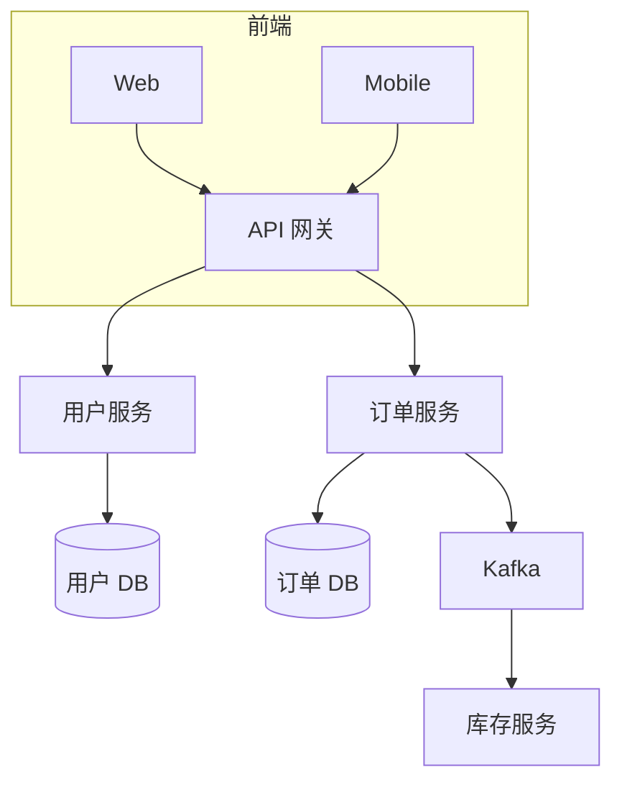
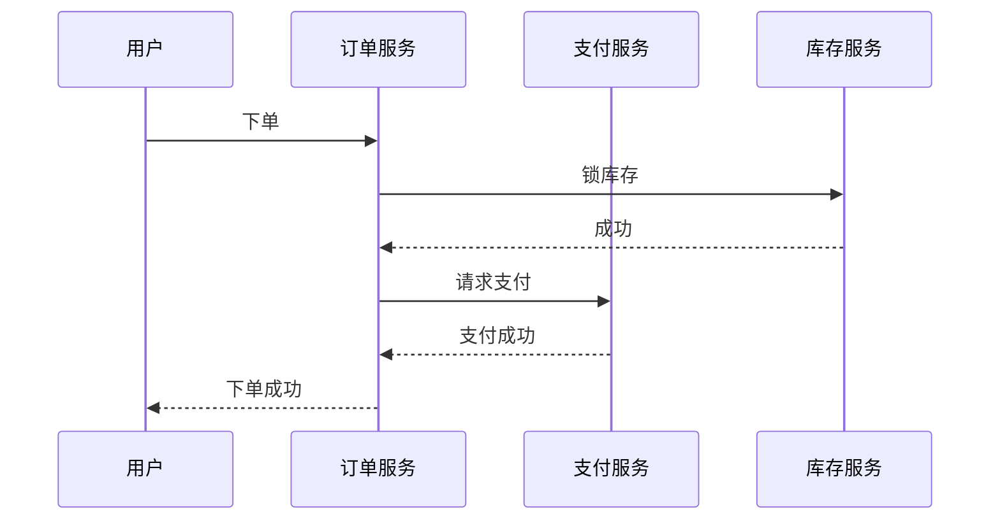
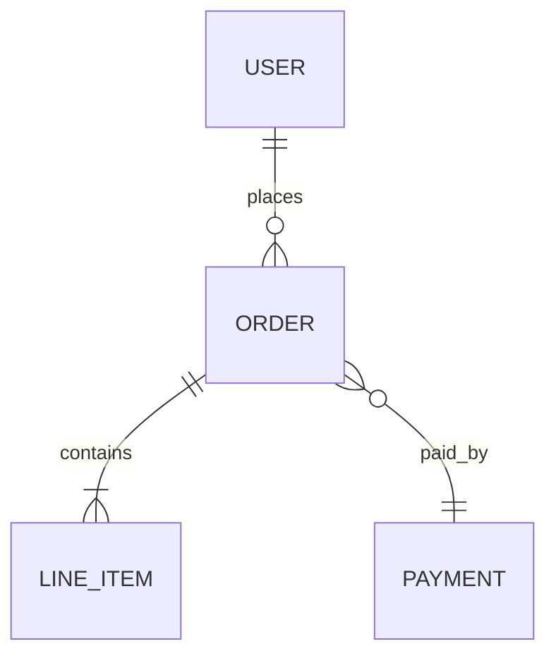

# 从代码到业务 - 逆向梳理工作流

> **核心问题**:对接到一个新项目/老项目/接手别人代码时,如何把"代码"反向翻译成"业务需求"和"业务逻辑"?
>
> **核心信念**:代码是"果",业务是"因"。把因找回来,代码就只是脚注。
>
> **本工作流的两条腿**:
> - **节奏**来自 [Keshav 三遍阅读法](How%20to%20Read%20a%20Paper%20-%20论文阅读方法论.md) — 鸟瞰 → 主线 → 虚拟重做
> - **纪律**来自 [三层递进分析法 (3LPA)](三层递进分析法.md) — 定义(看清) → 结构(想透) → 执行(动手)
>
> **经验法则**:
> - 三阶段走完 → 解决 80% 的"看不懂代码"问题
> - 卡在哪阶段 → 回到那一阶段重新走一遍,不要硬啃
> - 写完文档**必须**跟业务方/stakeholder 对一遍 — 没验证的整理都是自嗨

---

## 0. 适用场景

- 接手别人的项目(转岗、新人入职、外包交付)
- 老系统重构前的盘点
- 写交接文档
- 给团队新人做培训
- 重大代码评审前快速了解全貌
- 业务梳理 / 合规审计前的业务映射

**不适用**:纯查 bug、看一两个函数 — 那直接看代码就够了,不必上工作流。

---

## 1. 框架总览

```
┌─────────────────────────────────────────────────────────────┐
│  阶段 A · 鸟瞰(5-30 分钟)                                  │
│  = Keshav 第一遍 + 3LPA 第一层(定义)                       │
│  → 回答:这是个什么系统?                                    │
│  → 交付:一段话定位 + "代码版五个 C"                        │
└──────────────────────────┬──────────────────────────────────┘
                           ↓
┌─────────────────────────────────────────────────────────────┐
│  阶段 B · 画地图(1-3 小时)                                  │
│  = Keshav 第二遍 + 3LPA 第二层(结构)                       │
│  → 回答:业务怎么跑?主流程是什么?                           │
│  → 交付:架构图 + 业务流程图 + 实体关系图 + 主路径清单      │
└──────────────────────────┬──────────────────────────────────┘
                           ↓
┌─────────────────────────────────────────────────────────────┐
│  阶段 C · 写文档(数小时-数天)                               │
│  = Keshav 第三遍 + 3LPA 第三层(执行)                       │
│  → 回答:为什么这样写?业务规则是什么?                       │
│  → 交付:业务需求文档 + 业务逻辑文档 + 术语表               │
└─────────────────────────────────────────────────────────────┘
```

**关键纪律**:
- **不要一上来就钻函数** — 没鸟瞰就跳进函数,会迷失在细节里
- **三阶段各回答不同问题,不要混** — 第一阶段不要"想办法读懂它",第二阶段不要"动手写文档"
- **每阶段必须有"完成标志"** — 没达标就停下来,别往下走

---

## 2. 阶段 A · 鸟瞰(5-30 分钟)— 看清系统是什么

**对应**:Keshav 第一遍(五个 C)+ 3LPA 第一层(是什么/为什么/完成标志)

**回答的问题**:
- 这是个什么系统?
- 解决谁的什么问题?
- 主要能力 3-5 个是什么?
- 值不值得继续读下去?(如果是个死项目/玩具,读完阶段 A 就可以停)

### 2.1 动作清单(按顺序做)

1. **读 README / 文档 / 注释头** — 5 分钟,看作者自己怎么介绍
2. **看顶层目录结构** — 一级目录就是模块切分,通常能直接告诉你架构
3. **看依赖清单**(`package.json` / `go.mod` / `requirements.txt` / `Cargo.toml` / `pom.xml`)
   - 关键库(框架、ORM、消息队列、缓存)能反推技术选型
4. **看配置文件** — 知道连什么数据库、什么外部服务、用什么环境变量
5. **看入口文件**(`main` / `app` / `index` / `server`)— 启动逻辑读 30 秒
6. **跑起来** — Swagger / GraphQL Playground / 主页 / 一次健康检查
7. **看 Git 状态** — 最近 3 次 commit、贡献者、issue 数、是否有 CI

### 2.2 "代码版五个 C"(对照 Keshav)

| 五个 C | 落到代码上回答什么 |
| --- | --- |
| **Category** | Web 后端?CLI 工具?数据管道?嵌入式?前端 SPA? |
| **Context** | 用哪些框架/库?对应什么业务领域(电商/金融/SaaS/...)? |
| **Correctness** | 有测试吗?CI/CD 状态?最近一次提交多久前?issue 多吗? |
| **Contributions** | 主要功能 3-5 个是什么?(从 README + routes 提) |
| **Clarity** | 代码组织清晰吗?命名规范吗?注释多吗?一眼能读懂吗? |

### 2.3 交付物

**A. 一段话定位**(60 秒电梯测试)

> [系统名] 是一个 [类别:Web 后端 / 移动 App / 数据管道 / ...],服务 [用户:商家 / 终端用户 / 内部团队 / ...],主要解决 [核心问题]。它通过 [核心能力 1] / [核心能力 2] / [核心能力 3] 实现 [业务价值]。技术栈是 [关键栈]。

例:
> 订单服务是一个 Go Web 后端,服务终端消费者,主要解决"用户在 App 下单后如何把订单同步给仓库和支付"。它通过 REST API 接单、异步消息驱动库存扣减、对账任务日跑实现订单全链路处理。技术栈是 Go + Gin + MySQL + Kafka + Redis。

**B. 五个 C 表格填好**

### 2.4 完成标志

- [ ] 能用一段话(60 秒)跟陌生人讲清"这是 XX 系统,干 XX 的"
- [ ] "五个 C"都填得出来
- [ ] 知道用什么命令把项目跑起来

**没达标前不要进阶段 B**。

---

## 3. 阶段 B · 画地图(1-3 小时)— 想透业务怎么跑

**对应**:Keshav 第二遍(抓主线、记批注、勾未读引用)+ 3LPA 第二层(关键变量/路径/依赖/风险/未知项)

**回答的问题**:
- 业务是怎么跑起来的?
- 主流程有哪些?
- 关键模块怎么连?
- 核心实体是什么?
- 最复杂/最关键的模块是哪个?

### 3.1 动作清单(按顺序做)

1. **找核心实体** — 从 `models/` / `entities/` / `types/` / `schema.sql` / `migration` 入手,列出 5-10 个核心实体
2. **找入口到出口的主路径** — 跟着一个最常见的请求走完 Controller → Service → Repository,看数据怎么流
3. **识别 3-5 条主业务路径** — 每条 = 一个用户故事(如"用户注册"、"下单"、"退款")
4. **画架构图** — 模块/服务的依赖关系
5. **画业务流程图** — 主流程 + 异常路径(Mermaid 时序图或流程图)
6. **画实体关系图(ERD)** — 核心实体怎么连
7. **标记关键模块** — 哪些模块最复杂、哪些是瓶颈、哪些是核心域
8. **记录"看不懂"清单** — 暂时跳过的细节、奇怪的命名、过时的依赖,留到阶段 C

### 3.2 关键变量(对照 3LPA 第二层)

| 维度 | 在代码逆向场景下的问题 |
| --- | --- |
| **关键变量(可控 vs 不可控)** | 哪些模块在仓库内(可控)/ 哪些依赖外部服务(不可控,黑盒) |
| **路径选项** | 至少识别 2 条主业务路径(读路径 / 写路径;同步路径 / 异步路径) |
| **关键依赖** | 哪些外部服务必须在线(DB、消息队列、第三方 API)? |
| **关键风险** | 哪个模块一挂就整个系统挂? |
| **未知项** | 哪些命名/函数/文件看不懂?要优先变成"我去问谁 / 查什么" |

### 3.3 工具推荐

- **代码导航**:IDE 跳转、`grep` / `rg`、`ctags`、Sourcegraph
- **画图**:Mermaid(架构图/时序图/ERD)、Excalidraw、draw.io
- **依赖分析**:`depcheck` / `madge` / `go mod graph` / `cargo tree`
- **数据库**:逆向 ERD 工具(`mysql-workbench` / `dbdiagram.io` / `pgModeler`)

### 3.4 交付物

**A. 业务架构图**(Mermaid)



**B. 业务流程图**(Mermaid 时序图)



**C. 实体关系图**(Mermaid ERD)



**D. 主业务路径清单**

| 路径 | 用户故事 | 涉及模块 | 状态 |
| --- | --- | --- | --- |
| 1 | 用户注册 | 用户服务、邮件服务 | ✅ 已梳理 |
| 2 | 用户下单 | 订单服务、库存、支付 | ✅ 已梳理 |
| 3 | 退款 | 订单服务、支付服务 | ⏳ 待深入 |
| ... |

**E. "看不懂"清单**

| 项 | 为什么看不懂 | 计划怎么处理 |
| --- | --- | --- |
| `legacy/order.js:142` | 函数名奇怪,无注释 | 阶段 C 重点读 |
| 依赖 `magic-sdk@0.1.x` | 0.1 版本,文档稀缺 | 查 GitHub + 问原作者 |

### 3.5 完成标志

- [ ] 能画出系统的"主干道"图
- [ ] 能列出 3-5 个核心业务实体
- [ ] 能指出最关键/最复杂的模块
- [ ] "看不懂"清单已建立

**没达标前不要进阶段 C**。

---

## 4. 阶段 C · 写文档(数小时-数天)— 输出业务需求和业务逻辑

**对应**:Keshav 第三遍(虚拟重做、质疑假设)+ 3LPA 第三层(24h 第一步/反馈信号/检查点/升级/止损)

**回答的问题**:
- 为什么这样写?设计意图是什么?
- 业务规则是什么?(if-then、状态、约束)
- 如何用业务语言(而不是代码语言)描述?

### 4.1 动作清单(按顺序做)

1. **逐函数追踪核心业务** — 从控制器到服务到数据层,把阶段 B 标"看不懂"的清单逐个攻破
2. **虚拟重做** — 对每个核心模块问:"如果我来写,会怎么写?"对比"实际怎么写",找设计意图
3. **识别架构模式** — DDD 分层?事件驱动?CQRS?微服务?MVC?Hexagonal?
4. **挖业务规则** — 把代码里的 `if-else` / 状态机 / 校验逻辑翻译成业务语言
5. **整理业务术语表** — 代码命名 → 业务概念(例如:`Order.status === "PAID"` → 业务叫"已支付")
6. **画状态机** — 关键实体的状态变化(订单生命周期、用户状态机)
7. **写出两份文档** — 见 4.2
8. **验证** — 跟业务方/stakeholder 对一遍(必做)

### 4.2 两份核心文档

#### 文档 1:业务需求文档(What & Why)

```markdown
# [系统名] 业务需求文档

## 1. 业务背景
[这个系统为什么存在?业务上要解决什么问题?]

## 2. 目标用户
[谁会用这个系统?分几类用户?]

## 3. 核心场景(3-5 个)
[每条场景 = 一个用户故事]
- 场景 1:[用户] 在 [情境] 下,做 [动作],得到 [结果]
- 场景 2:...
- 场景 3:...

## 4. 业务目标 / KPI
[业务方关心的指标是什么?DAU、转化率、GMV、错误率?]

## 5. 约束与边界
[明确不做什么/做不到什么]
- 不做:跨境支付
- 不做:实时风控
```

#### 文档 2:业务逻辑文档(How)

```markdown
# [系统名] 业务逻辑文档

## 1. 核心实体
[5-10 个核心实体 + 字段 + 业务含义]

## 2. 主流程
[每条主路径 = 一节,配 Mermaid 时序图]

## 3. 状态机
[关键实体的状态变化,配 Mermaid stateDiagram]

## 4. 业务规则清单
- [R001] 订单金额 < 0 时拒绝创建
- [R002] 用户未实名认证时,单笔交易上限 1000 元
- [R003] 已支付订单 30 天内可申请退款
- ...

## 5. 异常处理
- 网络超时:重试 3 次后,事务回滚
- 库存不足:订单挂起,通知用户
- 支付失败:释放库存锁

## 6. 数据约束
- 用户名唯一
- 订单号格式:YYYYMMDD + 8 位序列
- 金额精度:分(整数,不用浮点)
```

### 4.3 业务术语表(单独维护)

| 代码命名 | 业务术语 | 说明 |
| --- | --- | --- |
| `Order.status === "PAID"` | 已支付 | 支付成功且回调确认 |
| `Order.status === "PENDING"` | 待支付 | 已下单未支付 |
| `User.kycLevel === 2` | 已实名 | 二级认证通过 |
| `MagicValue.AMBER` | 黄灯 | 风险等级中等 |

### 4.4 验证(必做)

写完文档**必须**做以下两件事之一:

1. **跟业务方/stakeholder 走一遍** — 让他读你的业务需求文档,问"这里我理解对吗?" 任何业务方觉得不对的地方,就是代码和需求"漂移"的点
2. **回放真实场景** — 拿历史工单 / 业务诉求 / 客服对话,看你的业务逻辑文档能不能解释每条

验证没通过 → 回阶段 B 重画地图,**不要在文档上打补丁**。

### 4.5 完成标志

- [ ] 业务需求文档完成,业务方读过无重大疑问
- [ ] 业务逻辑文档完成,能解释所有主流程
- [ ] 业务术语表完成,代码命名 ↔ 业务概念一一对应
- [ ] 业务规则清单完整(if-then 列表覆盖所有分支)
- [ ] 异常处理文档化

---

## 5. 跨阶段自检清单(对应 3LPA 5 项)

每次走完一遍三阶段,对照检查:

- [ ] **A 完成**:能一段话讲清系统是什么
- [ ] **B 完成**:能画出主业务流程图
- [ ] **B 完成**:能列出 3-5 个核心业务实体
- [ ] **B 完成**:能指出最关键/最复杂的模块
- [ ] **C 完成**:业务需求文档 + 业务逻辑文档 完成并经过验证

5 项都打勾 → 工作流走完,系统已"读懂"。

---

## 6. 三个跨阶段避坑点

### 坑 1:一上来就钻细节

**症状**:打开代码就跳进 `utils/strings.ts` 抠函数。
**问题**:迷失在细节里,三小时后还不知道系统是干嘛的。
**对策**:**强制**自己先花 30 分钟走完阶段 A。哪怕项目很小,鸟瞰都不能省。

### 坑 2:完全相信"代码 = 需求"

**症状**:把代码里的逻辑原样抄到业务需求文档。
**问题**:代码可能有过时逻辑、临时修补、dead code、隐性 bug 被当作"feature"。
**对策**:写完文档**必须验证**(阶段 C 第 8 步)。任何"业务方觉得不对"的地方,都是代码和真实需求的"漂移"。

### 坑 3:只整理不验证

**症状**:文档写得很漂亮,但没人读过。
**问题**:文档变成"自我安慰",跟真实业务脱节。
**对策**:阶段 C 验证是**必做**,不是选做。验证没通过,文档不算完成。

---

## 7. 何时停下(最后那 1%)

按 3LPA 的元问题问自己:

1. **这个系统"是"什么** — 它可能不是一个产品,而是内部工具/一次性脚本/实验代码 — 不要错把工具当产品梳理
2. **我"为什么"要梳理它** — 是为重构?交接?培训?明确目标,决定文档深度
3. **是不是换一种"使用方式"更划算** — 例如直接上手改、跑测试用例、问原作者 — 不必每次都写完整文档

如果三个元问题都答了仍卡着,接受这是"问题本身" — 把它记下来,不强求完成。

---

## 8. 实战模板(可直接复用)

```markdown
# [系统名] 业务梳理

## 阶段 A · 鸟瞰

### 一段话定位
[填好阶段 A 2.3 的模板]

### 五个 C

| 维度 | 回答 |
| --- | --- |
| Category | |
| Context | |
| Correctness | |
| Contributions | |
| Clarity | |

## 阶段 B · 画地图

### 业务架构图
[Mermaid graph TB]

### 业务流程图(主流程)
[Mermaid sequenceDiagram]

### 实体关系图
[Mermaid erDiagram]

### 主业务路径清单

| # | 用户故事 | 涉及模块 | 状态 |
| --- | --- | --- | --- |
| 1 | | | |
| 2 | | | |
| 3 | | | |

### "看不懂"清单

| 项 | 为什么看不懂 | 计划怎么处理 |
| --- | --- | --- |
| | | |

## 阶段 C · 写文档

### 业务需求文档
[见 4.2 文档 1 骨架]

### 业务逻辑文档
[见 4.2 文档 2 骨架]

### 业务术语表

| 代码命名 | 业务术语 | 说明 |
| --- | --- | --- |

### 业务规则清单
- [R001]
- [R002]
- ...

### 验证记录
- [ ] 业务方已读
- [ ] 历史工单已对
- 反馈:...

## 自检清单
- [ ] A 完成
- [ ] B 完成
- [ ] C 完成
```

---

## 9. 与其他框架的关系

| 框架 | 在本工作流中的角色 |
| --- | --- |
| [三层递进分析法 (3LPA)](三层递进分析法.md) | 提供"定义/结构/执行"的三层纪律 + 卡壳升级规则 + 元问题 |
| [How to Read a Paper](How%20to%20Read%20a%20Paper%20-%20论文阅读方法论.md) | 提供"鸟瞰/主线/虚拟重做"的三遍阅读节奏 + "五个 C" |
| 5W1H | 阶段 A 2.1 动作清单的底层逻辑 |
| MECE | 阶段 B 拆解主业务路径时的纪律 |
| 假设-证据配对 | 阶段 C "虚拟重做"时的具体技术 |
| DDD 战略设计 | 阶段 B 识别"核心域/支撑域/通用域"的语言 |

---

## 10. 给自己的提示

- **"读懂" ≠ "看完代码"**。"读懂"是能向业务方解释系统在做什么,以及为什么这样做
- **文档是给别人看的**,不是给自己看的 — 写的时候想象读者是"3 个月后入职的新人"
- **阶段 C 的验证是最容易被跳过的** — 跳过它,文档就只是"代码的中文翻译",不是"业务梳理"
- **小项目不必走完三阶段** — 100 行脚本只需要阶段 A;但 1 万行以上的服务,三阶段都不能省
